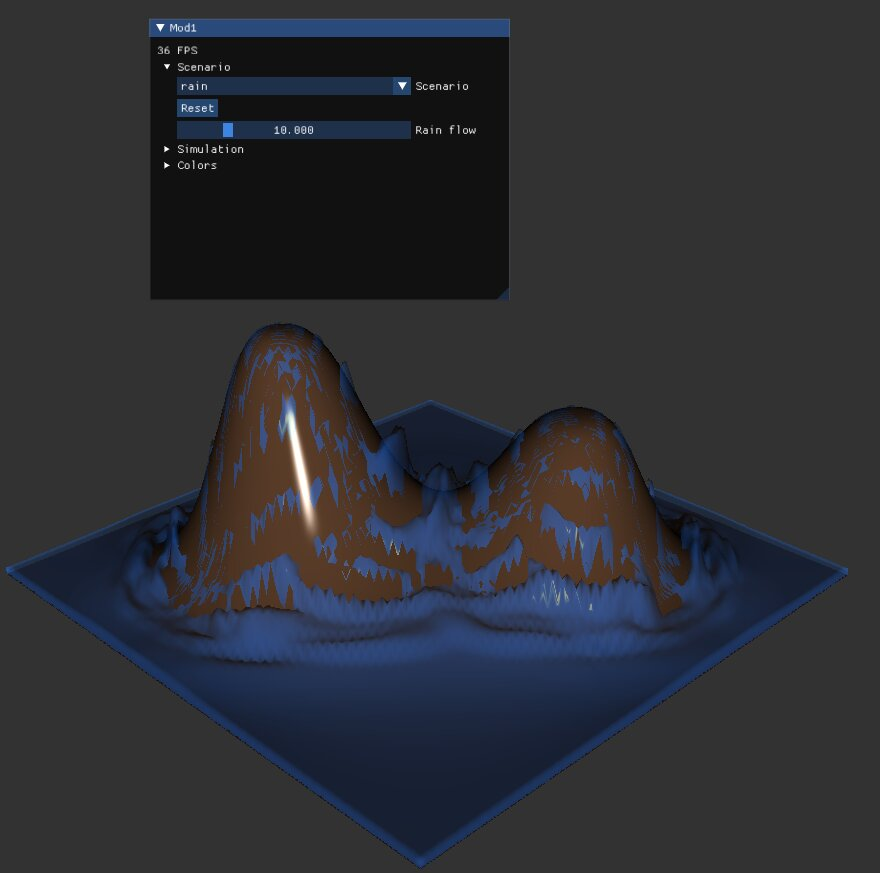
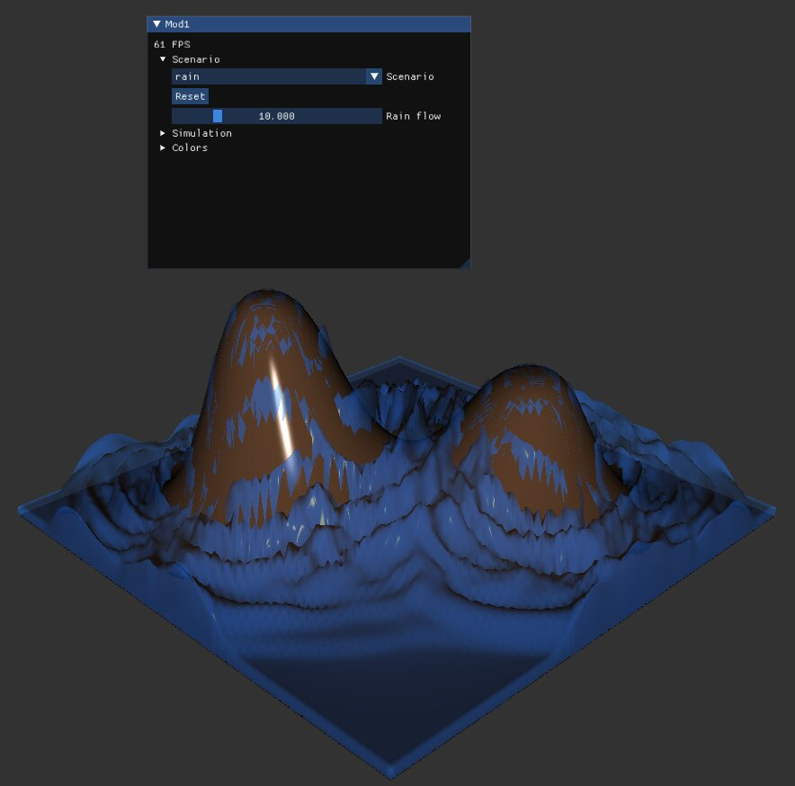

# Mod 1

3D water simulation using the pipe method

The solver uses a 2D staggered grid (heightmap)  
It stores the water depth at the center of each cell and the water flow between each of them  
This idea was first introduced by **James O’Brien** and **Jessica Hodgins** in [Dynamic simulation of splashing fluids, 1995](http://graphics.berkeley.edu/papers/Obrien-DSS-1995-04/Obrien-DSS-1995-04.pdf)  

The project uses [magnum](https://github.com/mosra/magnum) with [ImGui](https://github.com/ocornut/imgui)  

## screenshots


### Rain
<p float="left">
  
   
</p>

### Wave
<p float="left">
  
   
</p>

## Building

You will need cmake, sdl2, magnum and magnum imgui integration installed on your system alongside a C++20 compiler

```
git clone git@github.com:angauber/mod1.git
cd mod1
chmod +x build.sh
./build.sh
```

## Running
Run the binary with a map file as the first argument
```
./mod1 resources/demo2.mod1
```
